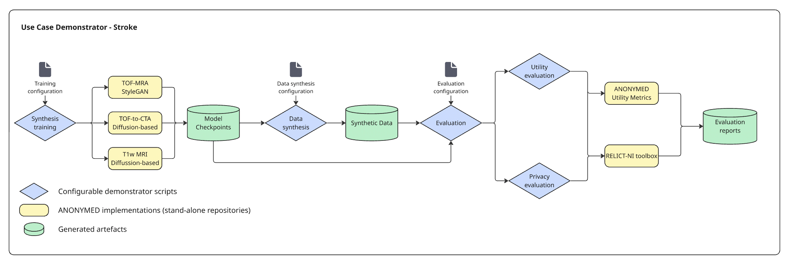

# Stroke Image Generation Demonstrator (ANONY-MED UseCase 1)

This Demonstrator showcases 3 Data Synthesis and 2 Evaluation sub-projects, developed for the Stroke use case in ANONY-MED. The repository follows the structure depicted on the figure.

## Data synthesis methods - [Link](./1_DATA_SYNTHESIS/)

* `Cross-modality synthesis` - TOF-MRA to CTA translation using diffusion models
* `Circle of Willis generation` - TOF-MRA generation centered on the Circle of Willis using 3D StyleGANv2 network
* `Differentially Private Image generation` - Differential privacy integrated into a 2D generative model

## Evaluation methods - [Link](./2_EVALUATION/)

* `Replica detection in synthetic neuroimaging data` - Identifying closest training images and likelihood of synthetic datasets containing replicas
* `Robustness of the Frechet Inception Distance (FID)` - TBA