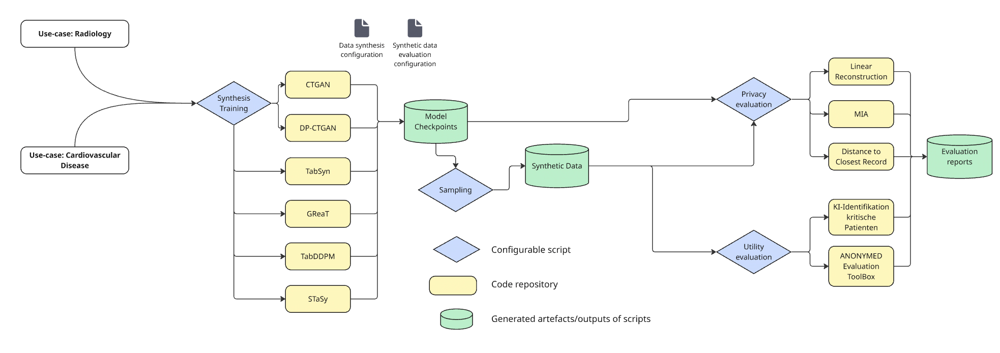

# Cardiology-/Radiology-report generation Demonstrator (ANONY-MED UseCase 2-3)

This Demonstrator showcases Data Synthesis and Evaluation sub-projects for the Cardiology and Radiology report generation use cases in ANONY-MED. The repository follows the structure depicted on the figure.
In contrary to the Stroke use case, data synthesis and evaluation methods are implemented in the same repository.

## Synthesis Training

## Data synthesis

## Evaluation

