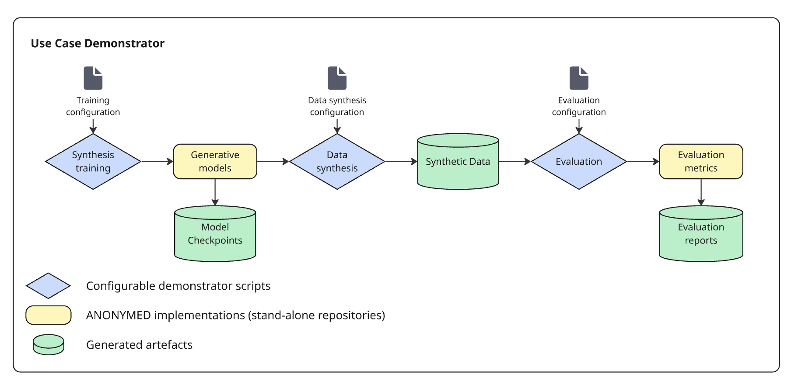

# ANONY-MED DEMONSTRATORS

This repository contains the resulting demonstrators from the project, [ANONY-MED](https://www.forschung-it-sicherheit-kommunikationssysteme.de/projekte/anony-med).

# Use-cases

* `Stroke`:
    * <u>Synthesis</u>: Generation of synthetic Time-of-flight MR Angiography (TOF-MRA) imaging, Cross-modality synthesis of CT Angiographic imaging from TOF-MRA, Differentially private generation of T1w MRI images.
    * <u>Evaluation</u>: Replica Detection in Synthetic Neuroimaging data (RELICT-NI).
* `Cardiology` / `Radiology reports`:
    * <u>Synthesis</u>: 
    * <u>Evaluation</u>: 

## General use-case architecture
Each demonstrator sub-repository follows the same architecture and provides instructions for 1) Training synthesis methods, 2) Running synthesis inference and 3) Evaluate the generated synthesic data from different perspectives.



# Install

```bash
git clone https://github.com/claim-berlin/ANONYMED-demonstrators.git
cd ANONYMED-demonstrators
git submodule update --init --recursive
```


## Funding statement
"Finanziert durch die Europäische Union – NextGenerationEU. Die geäußerten Ansichten und Meinungen sind ausschließlich die des Autors/der Autoren und spiegeln nicht unbedingt die Ansichten der Europäischen Union oder der Europäischen Kommission wieder. Weder die Europäische Union noch die Europäische Kommission können für sie verantwortlich gemacht werden."